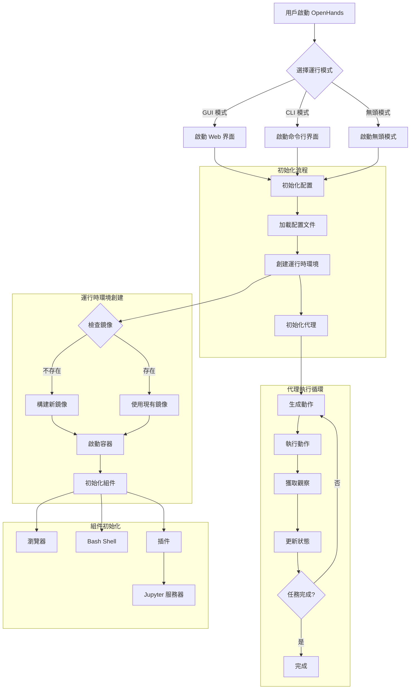

# OpenHands 程式碼解析

## 📚 專案概述

**OpenHands** (原名 OpenDevin) 是一個開源的 AI 軟體工程師平台,旨在模擬人類軟體工程師的工作流程,能夠自主完成複雜的軟體開發任務。

### 基本信息

- **原名**: OpenDevin
- **現名**: OpenHands
- **類型**: 開源 AI 軟體工程平台
- **主要功能**: 自主軟體開發 Agent
- **GitHub**: https://github.com/All-Hands-AI/OpenHands
- **語言**: Python
- **LLM 支持**: Claude、GPT-4、Gemini、DeepSeek 等
- **許可證**: MIT License

### 核心理念

OpenHands 的設計理念是創建一個能夠像人類軟體工程師一樣工作的 AI Agent,具備:
- 🔍 **理解需求**:分析和理解複雜的軟體需求
- 📝 **編寫代碼**:自主生成高質量代碼
- 🐛 **除錯修復**:定位和修復程式錯誤
- 🧪 **測試驗證**:編寫和執行測試
- 🔄 **迭代改進**:根據反饋持續優化

## 🎯 核心特性

### 1. 多模式運行

OpenHands 支持三種運行模式:

```bash
# GUI 模式 - 提供 Web 圖形界面
openhands --mode gui

# CLI 模式 - 命令行交互
openhands --mode cli

# 無頭模式 - 後台自動化執行
openhands --mode headless --task "implement user authentication"
```

### 2. 沙箱執行環境

- **Docker 容器隔離**:所有代碼執行都在 Docker 容器中
- **安全性保障**:防止惡意代碼影響宿主機
- **環境一致性**:確保開發環境的可重現性
- **資源控制**:限制 CPU、記憶體等資源使用

### 3. 多工具集成

OpenHands 整合了多種開發工具:

```python
工具列表:
├── Browser (瀏覽器)
│   ├── 網頁搜索
│   ├── 文檔查閱
│   └── API 文檔瀏覽
├── Bash Shell
│   ├── 命令執行
│   ├── 文件操作
│   └── 環境配置
├── Code Editor
│   ├── 文件讀寫
│   ├── 代碼編輯
│   └── 文件搜索
├── Jupyter Notebook
│   ├── 數據分析
│   ├── 模型訓練
│   └── 可視化
└── Git Integration
    ├── 版本控制
    ├── 分支管理
    └── 提交記錄
```

### 4. Agent 架構

OpenHands 採用插件化的 Agent 架構:

- **CodeActAgent**: 代碼執行型 Agent
- **PlannerAgent**: 任務規劃 Agent
- **MonologueAgent**: 自我對話推理 Agent
- **SWE-Agent**: 專門用於軟體工程任務

## 🏗️ 系統架構

### 整體架構圖

```
┌─────────────────────────────────────────────────────────────┐
│                       前端層 (Frontend)                      │
│  ┌────────────────┐  ┌────────────────┐  ┌───────────────┐ │
│  │   Web UI       │  │   CLI Interface │  │   API Server  │ │
│  │   (React)      │  │   (Python)      │  │   (FastAPI)   │ │
│  └────────────────┘  └────────────────┘  └───────────────┘ │
└─────────────────────────────────────────────────────────────┘
                              ↕
┌─────────────────────────────────────────────────────────────┐
│                    核心層 (Core Engine)                      │
│  ┌──────────────────────────────────────────────────────┐  │
│  │              Controller (控制器)                       │  │
│  │  - 任務調度                                            │  │
│  │  - Agent 生命週期管理                                  │  │
│  │  - EventStream 管理                                   │  │
│  └──────────────────────────────────────────────────────┘  │
│  ┌──────────────────────────────────────────────────────┐  │
│  │              Agent (代理)                              │  │
│  │  ┌────────────┐ ┌────────────┐ ┌─────────────────┐  │  │
│  │  │ CodeAct    │ │  Planner   │ │   Monologue     │  │  │
│  │  │  Agent     │ │   Agent    │ │     Agent       │  │  │
│  │  └────────────┘ └────────────┘ └─────────────────┘  │  │
│  └──────────────────────────────────────────────────────┘  │
│  ┌──────────────────────────────────────────────────────┐  │
│  │            EventStream (事件流)                        │  │
│  │  - Action 管理                                        │  │
│  │  - Observation 處理                                   │  │
│  │  - 歷史記錄維護                                        │  │
│  └──────────────────────────────────────────────────────┘  │
└─────────────────────────────────────────────────────────────┘
                              ↕
┌─────────────────────────────────────────────────────────────┐
│                   運行時層 (Runtime)                         │
│  ┌──────────────────────────────────────────────────────┐  │
│  │            Sandbox Manager (沙箱管理器)                │  │
│  │  - Docker 容器管理                                     │  │
│  │  - 鏡像構建                                            │  │
│  │  - 資源監控                                            │  │
│  └──────────────────────────────────────────────────────┘  │
│  ┌──────────────────────────────────────────────────────┐  │
│  │         Action Executor (動作執行器)                   │  │
│  │  ┌────────┐ ┌────────┐ ┌────────┐ ┌──────────────┐  │  │
│  │  │Browser │ │  Shell │ │ Editor │ │   Jupyter    │  │  │
│  │  └────────┘ └────────┘ └────────┘ └──────────────┘  │  │
│  └──────────────────────────────────────────────────────┘  │
└─────────────────────────────────────────────────────────────┘
                              ↕
┌─────────────────────────────────────────────────────────────┐
│                   LLM 層 (LLM Integration)                   │
│  ┌────────────┐ ┌────────────┐ ┌────────────┐            │
│  │  Anthropic │ │   OpenAI   │ │   Google   │   ...      │
│  │  (Claude)  │ │  (GPT-4)   │ │  (Gemini)  │            │
│  └────────────┘ └────────────┘ └────────────┘            │
└─────────────────────────────────────────────────────────────┘
```

## 🔄 完整工作流程

### 1. 系統啟動流程



### 2. Agent 執行循環詳解

```python
# openhands/controller/agent_controller.py

class AgentController:
    """Agent 控制器 - 管理 Agent 的完整生命週期"""

    def __init__(self, agent: Agent, event_stream: EventStream,
                 sandbox: Sandbox):
        self.agent = agent
        self.event_stream = event_stream
        self.sandbox = sandbox
        self.state = State.INIT

    async def run(self, task: str) -> None:
        """運行 Agent 執行任務"""
        # 1. 初始化任務
        await self._initialize_task(task)

        # 2. 主執行循環
        while not self._is_complete():
            try:
                # 2.1 Agent 生成動作
                action = await self.agent.step(self.state)

                # 2.2 記錄動作到事件流
                self.event_stream.add_event(ActionEvent(action))

                # 2.3 執行動作
                observation = await self._execute_action(action)

                # 2.4 記錄觀察結果
                self.event_stream.add_event(ObservationEvent(observation))

                # 2.5 更新狀態
                self.state = self._update_state(action, observation)

                # 2.6 檢查是否需要人工介入
                if self._requires_human_input(self.state):
                    await self._request_human_input()

            except Exception as e:
                # 錯誤處理
                await self._handle_error(e)

        # 3. 任務完成,清理資源
        await self._cleanup()

    async def _execute_action(self, action: Action) -> Observation:
        """執行動作並返回觀察結果"""
        if isinstance(action, CmdRunAction):
            # 執行命令
            result = await self.sandbox.execute_command(
                action.command,
                timeout=action.timeout
            )
            return CmdOutputObservation(
                content=result.output,
                exit_code=result.exit_code
            )

        elif isinstance(action, FileWriteAction):
            # 寫入文件
            await self.sandbox.write_file(
                action.path,
                action.content
            )
            return FileWriteObservation(
                path=action.path,
                success=True
            )

        elif isinstance(action, BrowseURLAction):
            # 瀏覽網頁
            content = await self.sandbox.browse(action.url)
            return BrowserOutputObservation(
                url=action.url,
                content=content
            )

        # ... 其他動作類型
```

### 3. Sandbox 環境管理

```python
# openhands/runtime/sandbox.py

class DockerSandbox:
    """Docker 沙箱環境"""

    def __init__(self, image: str, workspace: str):
        self.image = image
        self.workspace = workspace
        self.container = None

    async def start(self) -> None:
        """啟動沙箱容器"""
        # 1. 檢查鏡像
        if not await self._image_exists():
            await self._build_image()

        # 2. 創建容器
        self.container = await self.client.containers.create(
            image=self.image,
            command="/bin/bash",
            detach=True,
            working_dir=self.workspace,
            volumes={
                self.workspace: {
                    'bind': '/workspace',
                    'mode': 'rw'
                }
            },
            environment={
                'PYTHONUNBUFFERED': '1',
                'WORKSPACE': '/workspace'
            },
            # 資源限制
            mem_limit='4g',
            cpu_quota=100000,
            network_mode='bridge'
        )

        # 3. 啟動容器
        await self.container.start()

        # 4. 初始化環境
        await self._init_environment()

    async def execute_command(self, command: str,
                            timeout: int = 120) -> CommandResult:
        """在沙箱中執行命令"""
        try:
            # 執行命令
            exec_result = await self.container.exec_run(
                cmd=f"/bin/bash -c '{command}'",
                demux=True,
                environment={'WORKSPACE': '/workspace'}
            )

            # 解析輸出
            stdout = exec_result.output[0].decode() if exec_result.output[0] else ""
            stderr = exec_result.output[1].decode() if exec_result.output[1] else ""

            return CommandResult(
                exit_code=exec_result.exit_code,
                output=stdout,
                error=stderr
            )

        except asyncio.TimeoutError:
            raise SandboxTimeoutError(f"Command timed out after {timeout}s")

    async def write_file(self, path: str, content: str) -> None:
        """寫入文件到沙箱"""
        # 創建臨時文件
        with tempfile.NamedTemporaryFile(mode='w', delete=False) as f:
            f.write(content)
            temp_path = f.name

        try:
            # 複製到容器
            await self._copy_to_container(temp_path, path)
        finally:
            # 清理臨時文件
            os.unlink(temp_path)

    async def read_file(self, path: str) -> str:
        """從沙箱讀取文件"""
        result = await self.execute_command(f"cat {path}")
        if result.exit_code != 0:
            raise FileNotFoundError(f"File not found: {path}")
        return result.output
```

### 4. EventStream 事件流管理

```python
# openhands/events/stream.py

class EventStream:
    """事件流 - 記錄所有動作和觀察"""

    def __init__(self, session_id: str):
        self.session_id = session_id
        self.events: List[Event] = []
        self.subscribers: List[Callable] = []

    def add_event(self, event: Event) -> None:
        """添加事件到流"""
        # 1. 記錄事件
        event.id = len(self.events)
        event.timestamp = datetime.now()
        self.events.append(event)

        # 2. 持久化
        self._persist_event(event)

        # 3. 通知訂閱者
        self._notify_subscribers(event)

    def get_events(self,
                  event_type: Optional[Type[Event]] = None,
                  limit: Optional[int] = None) -> List[Event]:
        """獲取事件"""
        filtered = self.events

        # 按類型過濾
        if event_type:
            filtered = [e for e in filtered if isinstance(e, event_type)]

        # 限制數量
        if limit:
            filtered = filtered[-limit:]

        return filtered

    def get_history(self) -> str:
        """獲取歷史記錄的字符串表示"""
        history = []
        for event in self.events:
            if isinstance(event, ActionEvent):
                history.append(f"Action: {event.action}")
            elif isinstance(event, ObservationEvent):
                history.append(f"Observation: {event.observation}")
        return "\n".join(history)
```

## 💻 核心代碼分析

### 1. Agent 實現 - CodeActAgent

```python
# openhands/agenthub/codeact_agent/codeact_agent.py

class CodeActAgent(Agent):
    """CodeAct Agent - 通過代碼執行來完成任務"""

    def __init__(self, llm: LLM):
        super().__init__(llm)
        self.system_prompt = self._load_system_prompt()

    async def step(self, state: State) -> Action:
        """執行一步推理,生成下一個動作"""
        # 1. 構建提示詞
        messages = self._build_messages(state)

        # 2. 調用 LLM
        response = await self.llm.completion(
            messages=messages,
            temperature=0.0,
            stop_sequences=["</execute>"]
        )

        # 3. 解析響應
        action = self._parse_response(response)

        # 4. 驗證動作
        if not self._is_valid_action(action):
            # 如果動作無效,請求 LLM 重新生成
            return await self._retry_with_feedback(state, "Invalid action")

        return action

    def _build_messages(self, state: State) -> List[Message]:
        """構建發送給 LLM 的消息列表"""
        messages = [
            Message(role="system", content=self.system_prompt)
        ]

        # 添加任務描述
        if state.task:
            messages.append(
                Message(role="user", content=f"Task: {state.task}")
            )

        # 添加歷史對話
        for event in state.history.get_events():
            if isinstance(event, ActionEvent):
                messages.append(
                    Message(
                        role="assistant",
                        content=self._format_action(event.action)
                    )
                )
            elif isinstance(event, ObservationEvent):
                messages.append(
                    Message(
                        role="user",
                        content=self._format_observation(event.observation)
                    )
                )

        return messages

    def _parse_response(self, response: str) -> Action:
        """解析 LLM 響應為 Action 對象"""
        # CodeAct Agent 使用 XML 標籤格式
        # <execute>command here</execute>

        if "<execute>" in response:
            # 提取命令
            match = re.search(r'<execute>(.*?)</execute>',
                            response, re.DOTALL)
            if match:
                command = match.group(1).strip()
                return CmdRunAction(command=command)

        elif "<write_file>" in response:
            # 提取文件寫入
            path_match = re.search(r'path="([^"]+)"', response)
            content_match = re.search(r'<write_file[^>]*>(.*?)</write_file>',
                                    response, re.DOTALL)
            if path_match and content_match:
                return FileWriteAction(
                    path=path_match.group(1),
                    content=content_match.group(1)
                )

        elif "<finish>" in response:
            # 任務完成
            return AgentFinishAction()

        # 默認返回思考動作
        return AgentThinkAction(thought=response)
```

### 2. 瀏覽器集成

```python
# openhands/runtime/browser.py

class Browser:
    """瀏覽器工具 - 用於網頁瀏覽和信息檢索"""

    def __init__(self):
        self.playwright = None
        self.browser = None
        self.page = None

    async def start(self) -> None:
        """啟動瀏覽器"""
        self.playwright = await async_playwright().start()
        self.browser = await self.playwright.chromium.launch(
            headless=True,
            args=['--no-sandbox']
        )
        self.page = await self.browser.new_page()

    async def goto(self, url: str) -> str:
        """訪問 URL 並返回頁面內容"""
        try:
            # 訪問頁面
            await self.page.goto(url, wait_until='networkidle')

            # 提取主要內容
            content = await self._extract_content()

            return content

        except Exception as e:
            return f"Error browsing {url}: {str(e)}"

    async def _extract_content(self) -> str:
        """提取頁面主要內容"""
        # 獲取頁面文本
        text = await self.page.evaluate('''() => {
            // 移除腳本和樣式
            const scripts = document.querySelectorAll('script, style');
            scripts.forEach(s => s.remove());

            // 獲取主體內容
            const body = document.body;
            return body ? body.innerText : '';
        }''')

        # 清理和格式化
        lines = text.split('\n')
        cleaned = [line.strip() for line in lines if line.strip()]

        return '\n'.join(cleaned)

    async def screenshot(self, path: str) -> None:
        """截取頁面截圖"""
        await self.page.screenshot(path=path, full_page=True)
```

## 🎯 使用場景

### 1. Bug 修復

```bash
# 使用 OpenHands 自動修復 Bug
openhands --mode cli

# 用戶輸入
> 我的 Python 程序在處理大文件時會內存溢出,請幫我修復

# OpenHands 執行流程:
# 1. 分析代碼找出內存問題
# 2. 提出解決方案(使用生成器、分塊處理等)
# 3. 修改代碼
# 4. 編寫測試驗證修復
# 5. 運行測試確保修復有效
```

### 2. 功能開發

```bash
# 開發新功能
> 請為我的 Django 項目添加用戶認證功能,包括註冊、登錄、登出和密碼重置

# OpenHands 會:
# 1. 分析現有項目結構
# 2. 創建必要的模型(User model)
# 3. 創建視圖和表單
# 4. 配置 URL 路由
# 5. 創建模板文件
# 6. 編寫測試
# 7. 運行測試驗證功能
```

### 3. 代碼重構

```bash
# 重構代碼
> 請重構 utils.py 文件,提高代碼可讀性和性能

# OpenHands 會:
# 1. 分析現有代碼結構
# 2. 識別可改進的部分
# 3. 應用最佳實踐進行重構
# 4. 確保功能不變
# 5. 運行測試驗證
```

### 4. 文檔生成

```bash
# 生成文檔
> 為我的 API 項目生成 OpenAPI 文檔

# OpenHands 會:
# 1. 分析 API 端點
# 2. 提取參數和響應格式
# 3. 生成 OpenAPI schema
# 4. 創建 README 和使用示例
```

## 🔑 關鍵特性實現

### 1. 安全沙箱機制

OpenHands 通過 Docker 容器提供安全隔離:

```python
# 安全特性:
安全隔離:
├── 網絡隔離 (bridge 模式)
├── 文件系統隔離 (volume mount)
├── 資源限制
│   ├── CPU quota
│   ├── Memory limit
│   └── Disk quota
├── 權限控制
│   └── 非 root 用戶運行
└── 超時控制
    └── 命令執行超時
```

### 2. 多 LLM 支持

```python
# openhands/llm/llm.py

class LLMConfig:
    """LLM 配置"""
    model: str
    api_key: str
    base_url: Optional[str] = None
    temperature: float = 0.0
    max_tokens: int = 4096

# 支持的 LLM:
LLM_PROVIDERS = {
    'anthropic': {
        'models': ['claude-3-opus', 'claude-3-sonnet', 'claude-3-haiku'],
        'api_base': 'https://api.anthropic.com'
    },
    'openai': {
        'models': ['gpt-4', 'gpt-4-turbo', 'gpt-3.5-turbo'],
        'api_base': 'https://api.openai.com'
    },
    'google': {
        'models': ['gemini-pro', 'gemini-ultra'],
        'api_base': 'https://generativelanguage.googleapis.com'
    },
    'local': {
        'models': ['ollama/*', 'llama-cpp/*'],
        'api_base': 'http://localhost:11434'
    }
}
```

## 🚀 最佳實踐

### 1. 任務描述技巧

**詳細明確的任務描述**:

```markdown
好的任務描述:
- 具體目標:實現用戶登錄功能
- 技術棧:使用 Flask + SQLAlchemy + JWT
- 具體需求:
  1. 創建 User 模型,包含 username, email, password
  2. 實現註冊端點 POST /api/register
  3. 實現登錄端點 POST /api/login,返回 JWT token
  4. 密碼使用 bcrypt 加密
  5. 添加輸入驗證
  6. 編寫單元測試

不好的任務描述:
- 做一個登錄
```

### 2. 配置優化

```yaml
# config.toml

[core]
workspace_base = "./workspace"
cache_dir = "./cache"
max_iterations = 50  # 最大迭代次數
timeout = 300  # 超時時間(秒)

[sandbox]
image = "openhands/sandbox:latest"
memory_limit = "4g"
cpu_quota = 100000
enable_auto_lint = true

[agent]
type = "CodeActAgent"
temperature = 0.0
max_message_chars = 10000

[llm]
model = "claude-3-sonnet-20240229"
api_key = "${ANTHROPIC_API_KEY}"
max_tokens = 4096
```

### 3. 監控和調試

```python
# 啟用詳細日誌
import logging
logging.basicConfig(level=logging.DEBUG)

# 使用事件流追蹤執行
for event in event_stream.get_events():
    print(f"[{event.timestamp}] {event.type}: {event.data}")

# 檢查沙箱狀態
sandbox_status = await sandbox.get_status()
print(f"Container: {sandbox_status.container_id}")
print(f"Memory: {sandbox_status.memory_usage}")
print(f"CPU: {sandbox_status.cpu_usage}")
```

## 📊 與其他 Agent 的對比

### OpenHands vs Cline

| 特性 | OpenHands | Cline |
|------|-----------|-------|
| **部署方式** | 獨立應用 / Web 服務 | VS Code 擴展 |
| **執行環境** | Docker 容器 | 本地文件系統 |
| **界面** | Web UI + CLI | VS Code 側邊欄 |
| **自主性** | 高度自主,可無人值守 | 需要用戶審批 |
| **複雜任務** | 適合長時間複雜任務 | 適合中等複雜度 |
| **安全性** | Docker 隔離,更安全 | 依賴用戶審批 |
| **團隊協作** | 支持多用戶 Web 訪問 | 單用戶本地使用 |

### OpenHands vs AutoGPT

| 特性 | OpenHands | AutoGPT |
|------|-----------|---------|
| **專注領域** | 軟體工程 | 通用任務 |
| **工具集成** | 深度集成開發工具 | 廣泛但淺層集成 |
| **代碼質量** | 專為編程優化 | 通用代碼生成 |
| **可靠性** | 更穩定,專注單一領域 | 不穩定,範圍太廣 |

## ⚠️ 注意事項和限制

### 安全考慮

1. **代碼審查**: 始終審查 Agent 生成的代碼
2. **沙箱限制**: 雖然有 Docker 隔離,但仍需注意
3. **API 密鑰**: 妥善保管 LLM API 密鑰
4. **資源消耗**: 監控 Docker 容器資源使用

### 成本控制

```python
# 估算成本
任務複雜度 → Token 使用量 → API 成本

簡單任務 (修改配置):
- ~5,000 tokens
- ~$0.01 (Claude Sonnet)

中等任務 (添加功能):
- ~50,000 tokens
- ~$0.10 (Claude Sonnet)

複雜任務 (完整項目):
- ~500,000 tokens
- ~$1.00 (Claude Sonnet)
```

### 當前限制

1. **UI 操作**: 無法處理圖形界面應用
2. **實時交互**: 不適合需要實時響應的場景
3. **大型項目**: 對於超大型項目可能理解不夠深入
4. **特定領域知識**: 某些專業領域知識可能不足

## 📖 擴展開發

### 自定義 Agent

```python
# 創建自定義 Agent
from openhands.agent import Agent

class CustomAgent(Agent):
    """自定義 Agent 實現"""

    def __init__(self, llm):
        super().__init__(llm)
        self.custom_tools = self._load_custom_tools()

    async def step(self, state):
        # 實現自定義推理邏輯
        pass

# 註冊 Agent
AGENT_REGISTRY['custom'] = CustomAgent
```

### 添加自定義工具

```python
# 添加自定義工具
from openhands.runtime.tools import Tool

class CustomTool(Tool):
    """自定義工具"""

    name = "custom_tool"
    description = "執行自定義操作"

    async def execute(self, **kwargs):
        # 實現工具邏輯
        pass
```

## 📚 學習資源

- **官方文檔**: https://docs.all-hands.dev
- **GitHub**: https://github.com/All-Hands-AI/OpenHands
- **Discord 社區**: https://discord.gg/ESHStjSjD4
- **論文**: [OpenDevin: An Open Platform for AI Software Developers as Generalist Agents](https://arxiv.org/abs/2407.16741)

## 🔮 未來發展方向

1. **多 Agent 協作**: 多個 Agent 並行工作
2. **更強的規劃能力**: 更好的長期任務規劃
3. **GUI 應用支持**: 支持圖形界面應用操作
4. **持續學習**: 從歷史任務中學習改進
5. **企業級功能**: 權限管理、審計日誌等

---

**總結**: OpenHands 是一個強大的開源 AI 軟體工程平台,通過 Docker 沙箱提供安全的執行環境,支持多種 LLM,能夠自主完成複雜的軟體開發任務。它特別適合自動化重複性開發任務、快速原型開發和代碼維護工作。
