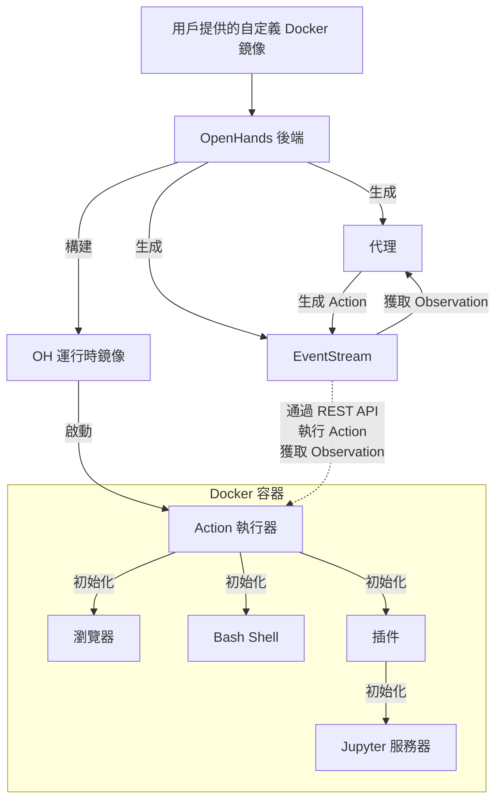

# OpenHands Docker 交互流程深度解析

## 📚 概述

OpenHands 使用 Docker 容器作為代碼執行的沙箱環境,實現安全隔離和環境一致性。本文深入解析 OpenHands 與 Docker 的交互機制。

## 🏗️ 整體架構

### 架構層次圖



### 三層架構

```
┌──────────────────────────────────────────────────────┐
│           應用層 (Application Layer)                  │
│  ┌─────────────┐  ┌─────────────┐  ┌─────────────┐ │
│  │   Agent     │  │ EventStream │  │  Controller │ │
│  └─────────────┘  └─────────────┘  └─────────────┘ │
└──────────────────────────────────────────────────────┘
                      ↕ REST API
┌──────────────────────────────────────────────────────┐
│         通信層 (Communication Layer)                  │
│  ┌──────────────────────────────────────────────┐   │
│  │         Runtime Server (FastAPI)              │   │
│  │  - Action 接收端點                             │   │
│  │  - Observation 返回端點                        │   │
│  │  - WebSocket 實時通信                          │   │
│  └──────────────────────────────────────────────┘   │
└──────────────────────────────────────────────────────┘
                      ↕ Container Exec
┌──────────────────────────────────────────────────────┐
│           執行層 (Execution Layer)                    │
│  ┌────────────────────────────────────────────┐     │
│  │      Docker Container (Sandbox)             │     │
│  │  ┌──────────┐ ┌──────────┐ ┌───────────┐  │     │
│  │  │ Browser  │ │   Shell  │ │  Jupyter  │  │     │
│  │  └──────────┘ └──────────┘ └───────────┘  │     │
│  │  ┌──────────────────────────────────────┐  │     │
│  │  │      File System & Workspace          │  │     │
│  │  └──────────────────────────────────────┘  │     │
│  └────────────────────────────────────────────┘     │
└──────────────────────────────────────────────────────┘
```

## 🔄 完整交互流程

### 1. 鏡像構建流程

```python
# openhands/runtime/docker/image_builder.py

class ImageBuilder:
    """Docker 鏡像構建器"""

    def __init__(self, base_image: str, custom_dockerfile: Optional[str] = None):
        self.base_image = base_image
        self.custom_dockerfile = custom_dockerfile
        self.docker_client = docker.from_env()

    def build_runtime_image(self) -> str:
        """構建 OpenHands 運行時鏡像"""
        # 1. 準備 Dockerfile
        dockerfile_content = self._generate_dockerfile()

        # 2. 創建構建上下文
        build_context = self._create_build_context(dockerfile_content)

        # 3. 構建鏡像
        image, build_logs = self.docker_client.images.build(
            fileobj=build_context,
            tag=f"openhands-runtime:{uuid.uuid4().hex[:8]}",
            rm=True,  # 構建後刪除中間容器
            forcerm=True,  # 即使失敗也刪除中間容器
            pull=True  # 拉取最新基礎鏡像
        )

        # 4. 記錄構建日誌
        for log in build_logs:
            if 'stream' in log:
                print(log['stream'], end='')

        return image.tags[0]

    def _generate_dockerfile(self) -> str:
        """生成 Dockerfile 內容"""
        if self.custom_dockerfile:
            # 使用用戶提供的 Dockerfile
            base_content = self.custom_dockerfile
        else:
            # 使用默認基礎鏡像
            base_content = f"FROM {self.base_image}"

        # 添加 OpenHands 運行時組件
        runtime_setup = """
# 安裝 OpenHands 運行時依賴
RUN apt-get update && apt-get install -y \\
    curl \\
    wget \\
    git \\
    vim \\
    build-essential \\
    python3-pip \\
    nodejs \\
    npm

# 安裝 Python 依賴
COPY requirements.txt /tmp/
RUN pip3 install -r /tmp/requirements.txt

# 安裝瀏覽器 (用於 Browser 工具)
RUN playwright install chromium
RUN playwright install-deps

# 設置工作目錄
WORKDIR /workspace

# 複製運行時服務器代碼
COPY runtime_server.py /opt/openhands/
COPY action_executor.py /opt/openhands/

# 設置環境變量
ENV PYTHONUNBUFFERED=1
ENV WORKSPACE=/workspace

# 啟動運行時服務器
CMD ["python3", "/opt/openhands/runtime_server.py"]
"""

        return base_content + "\n" + runtime_setup
```

### 2. 容器啟動和管理

```python
# openhands/runtime/docker/container_manager.py

class ContainerManager:
    """Docker 容器管理器"""

    def __init__(self, image: str, workspace: str):
        self.image = image
        self.workspace = workspace
        self.docker_client = docker.from_env()
        self.container = None
        self.runtime_port = None

    async def start_container(self) -> Dict[str, Any]:
        """啟動 Docker 容器"""
        # 1. 查找可用端口
        self.runtime_port = self._find_free_port()

        # 2. 創建並啟動容器
        self.container = self.docker_client.containers.run(
            image=self.image,
            detach=True,  # 後台運行
            network_mode='bridge',  # 橋接網絡模式
            ports={
                '8000/tcp': self.runtime_port  # 映射運行時服務器端口
            },
            volumes={
                # 掛載工作目錄
                os.path.abspath(self.workspace): {
                    'bind': '/workspace',
                    'mode': 'rw'
                },
                # 掛載 Docker socket (如需要)
                '/var/run/docker.sock': {
                    'bind': '/var/run/docker.sock',
                    'mode': 'ro'
                }
            },
            environment={
                'PYTHONUNBUFFERED': '1',
                'WORKSPACE': '/workspace',
                'RUNTIME_PORT': '8000'
            },
            # 資源限制
            mem_limit='4g',
            memswap_limit='4g',
            cpu_quota=100000,  # 相當於 1 CPU
            cpu_period=100000,
            # 安全設置
            security_opt=['no-new-privileges'],
            cap_drop=['ALL'],
            cap_add=['CHOWN', 'DAC_OVERRIDE', 'SETGID', 'SETUID'],
            # 自動重啟
            restart_policy={'Name': 'on-failure', 'MaximumRetryCount': 3}
        )

        # 3. 等待運行時服務器就緒
        await self._wait_for_runtime_ready()

        # 4. 初始化組件
        await self._initialize_components()

        return {
            'container_id': self.container.id,
            'runtime_url': f'http://localhost:{self.runtime_port}',
            'status': 'running'
        }

    async def _wait_for_runtime_ready(self, timeout: int = 30) -> None:
        """等待運行時服務器就緒"""
        start_time = time.time()
        runtime_url = f'http://localhost:{self.runtime_port}/health'

        while time.time() - start_time < timeout:
            try:
                response = requests.get(runtime_url, timeout=1)
                if response.status_code == 200:
                    logger.info("Runtime server is ready")
                    return
            except requests.exceptions.RequestException:
                pass

            await asyncio.sleep(1)

        raise RuntimeError("Runtime server failed to start")

    async def _initialize_components(self) -> None:
        """初始化容器內的組件"""
        runtime_url = f'http://localhost:{self.runtime_port}'

        # 初始化瀏覽器
        await self._call_runtime_api(
            f'{runtime_url}/initialize',
            {'component': 'browser'}
        )

        # 初始化 Jupyter (如需要)
        await self._call_runtime_api(
            f'{runtime_url}/initialize',
            {'component': 'jupyter'}
        )

    async def stop_container(self) -> None:
        """停止並清理容器"""
        if self.container:
            # 優雅停止
            self.container.stop(timeout=10)

            # 刪除容器
            self.container.remove(force=True)

            logger.info(f"Container {self.container.id} stopped and removed")
```

### 3. Runtime Server 實現

```python
# runtime_server.py (運行在容器內)

from fastapi import FastAPI, HTTPException
from pydantic import BaseModel
import subprocess
import asyncio
from typing import Any, Dict

app = FastAPI()

# 瀏覽器和其他組件的全局實例
browser = None
jupyter_server = None

class Action(BaseModel):
    """Action 數據模型"""
    type: str
    params: Dict[str, Any]

class Observation(BaseModel):
    """Observation 數據模型"""
    type: str
    content: Any
    success: bool
    error: str = None

@app.get("/health")
async def health_check():
    """健康檢查端點"""
    return {"status": "healthy"}

@app.post("/initialize")
async def initialize_component(component: str):
    """初始化組件"""
    global browser, jupyter_server

    if component == "browser":
        # 啟動瀏覽器
        from playwright.async_api import async_playwright
        playwright = await async_playwright().start()
        browser = await playwright.chromium.launch(headless=True)
        return {"status": "browser initialized"}

    elif component == "jupyter":
        # 啟動 Jupyter 服務器
        process = subprocess.Popen([
            'jupyter', 'notebook',
            '--ip=0.0.0.0',
            '--port=8888',
            '--no-browser',
            '--allow-root'
        ])
        jupyter_server = process
        return {"status": "jupyter initialized"}

    else:
        raise HTTPException(status_code=400, detail=f"Unknown component: {component}")

@app.post("/execute")
async def execute_action(action: Action) -> Observation:
    """執行 Action 並返回 Observation"""
    try:
        if action.type == "cmd_run":
            # 執行命令
            result = await execute_command(action.params['command'])
            return Observation(
                type="cmd_output",
                content=result['output'],
                success=result['exit_code'] == 0
            )

        elif action.type == "file_write":
            # 寫入文件
            path = action.params['path']
            content = action.params['content']
            with open(path, 'w') as f:
                f.write(content)
            return Observation(
                type="file_write",
                content=f"File written: {path}",
                success=True
            )

        elif action.type == "file_read":
            # 讀取文件
            path = action.params['path']
            with open(path, 'r') as f:
                content = f.read()
            return Observation(
                type="file_read",
                content=content,
                success=True
            )

        elif action.type == "browse":
            # 瀏覽網頁
            url = action.params['url']
            page = await browser.new_page()
            await page.goto(url)
            content = await page.content()
            await page.close()
            return Observation(
                type="browser_output",
                content=content,
                success=True
            )

        else:
            raise ValueError(f"Unknown action type: {action.type}")

    except Exception as e:
        return Observation(
            type="error",
            content=str(e),
            success=False,
            error=str(e)
        )

async def execute_command(command: str) -> Dict[str, Any]:
    """執行 Shell 命令"""
    process = await asyncio.create_subprocess_shell(
        command,
        stdout=asyncio.subprocess.PIPE,
        stderr=asyncio.subprocess.PIPE,
        cwd='/workspace'
    )

    stdout, stderr = await process.communicate()

    return {
        'exit_code': process.returncode,
        'output': stdout.decode() if stdout else "",
        'error': stderr.decode() if stderr else ""
    }

if __name__ == "__main__":
    import uvicorn
    uvicorn.run(app, host="0.0.0.0", port=8000)
```

### 4. Action 執行器 (在主程序中)

```python
# openhands/runtime/docker/action_executor.py

class DockerActionExecutor:
    """通過 REST API 在 Docker 容器中執行 Action"""

    def __init__(self, runtime_url: str):
        self.runtime_url = runtime_url
        self.session = requests.Session()

    async def execute(self, action: Action) -> Observation:
        """執行 Action"""
        # 1. 將 Action 序列化
        action_data = {
            'type': action.action_type,
            'params': action.params
        }

        # 2. 發送到容器內的運行時服務器
        try:
            response = self.session.post(
                f'{self.runtime_url}/execute',
                json=action_data,
                timeout=120  # 2分鐘超時
            )
            response.raise_for_status()

            # 3. 解析 Observation
            obs_data = response.json()
            return Observation(
                observation_type=obs_data['type'],
                content=obs_data['content'],
                success=obs_data['success'],
                error=obs_data.get('error')
            )

        except requests.exceptions.Timeout:
            return Observation(
                observation_type='error',
                content='Action execution timed out',
                success=False,
                error='Timeout'
            )

        except requests.exceptions.RequestException as e:
            return Observation(
                observation_type='error',
                content=f'Failed to execute action: {str(e)}',
                success=False,
                error=str(e)
            )
```

## 🔑 關鍵技術實現

### 1. 文件同步機制

```python
# 使用 Docker Volume 實現實時文件同步

# 主機端
workspace_path = "/home/user/projects/myapp"

# 容器內
container_workspace = "/workspace"

# Volume 配置
volumes = {
    os.path.abspath(workspace_path): {
        'bind': container_workspace,
        'mode': 'rw'  # 讀寫模式
    }
}

# 這樣主機和容器共享同一個文件系統
# 任何一方的修改都會立即反映到另一方
```

### 2. 網絡通信

```python
# 端口映射配置
ports = {
    '8000/tcp': ('127.0.0.1', runtime_port),  # 運行時服務器
    '8888/tcp': ('127.0.0.1', jupyter_port),  # Jupyter
}

# 通過 localhost 訪問容器服務
runtime_url = f'http://localhost:{runtime_port}'

# 發送請求
response = requests.post(
    f'{runtime_url}/execute',
    json={'type': 'cmd_run', 'params': {'command': 'ls -la'}}
)
```

### 3. 資源限制和監控

```python
# openhands/runtime/docker/resource_monitor.py

class ResourceMonitor:
    """監控容器資源使用"""

    def __init__(self, container):
        self.container = container

    def get_stats(self) -> Dict[str, Any]:
        """獲取容器資源統計"""
        stats = self.container.stats(stream=False)

        # CPU 使用率
        cpu_delta = stats['cpu_stats']['cpu_usage']['total_usage'] - \
                   stats['precpu_stats']['cpu_usage']['total_usage']
        system_delta = stats['cpu_stats']['system_cpu_usage'] - \
                      stats['precpu_stats']['system_cpu_usage']
        cpu_percent = (cpu_delta / system_delta) * 100.0 if system_delta > 0 else 0

        # 內存使用
        mem_usage = stats['memory_stats']['usage']
        mem_limit = stats['memory_stats']['limit']
        mem_percent = (mem_usage / mem_limit) * 100.0

        return {
            'cpu_percent': cpu_percent,
            'memory_usage': mem_usage,
            'memory_limit': mem_limit,
            'memory_percent': mem_percent,
            'network_rx': stats['networks']['eth0']['rx_bytes'],
            'network_tx': stats['networks']['eth0']['tx_bytes']
        }
```

## 🎯 實際應用場景

### 場景 1: 執行 Python 腳本

```python
# 用戶請求: 運行 Python 腳本
action = Action(
    action_type='cmd_run',
    params={'command': 'python3 /workspace/script.py'}
)

# 執行流程:
# 1. Agent 生成 Action
# 2. Controller 發送 Action 到 Runtime Server
# 3. Runtime Server 在容器內執行 Python 腳本
# 4. 返回 Observation (輸出、錯誤等)
# 5. Agent 根據結果決定下一步

observation = await executor.execute(action)
print(observation.content)  # 腳本輸出
```

### 場景 2: 瀏覽器自動化

```python
# 用戶請求: 搜索技術文檔
action = Action(
    action_type='browse',
    params={
        'url': 'https://docs.python.org/3/library/asyncio.html',
        'extract': 'main_content'
    }
)

# 在容器內的瀏覽器執行
observation = await executor.execute(action)

# Agent 分析文檔內容
documentation = observation.content
# ... 使用文檔信息
```

### 場景 3: 多步驟任務

```python
# 複雜任務: 創建並測試新功能

# 步驟 1: 創建文件
action1 = Action(
    action_type='file_write',
    params={
        'path': '/workspace/utils.py',
        'content': 'def hello():\n    print("Hello, World!")'
    }
)
obs1 = await executor.execute(action1)

# 步驟 2: 創建測試
action2 = Action(
    action_type='file_write',
    params={
        'path': '/workspace/test_utils.py',
        'content': 'from utils import hello\n\ndef test_hello():\n    hello()'
    }
)
obs2 = await executor.execute(action2)

# 步驟 3: 運行測試
action3 = Action(
    action_type='cmd_run',
    params={'command': 'python3 -m pytest test_utils.py -v'}
)
obs3 = await executor.execute(action3)

# 分析測試結果
if 'PASSED' in obs3.content:
    print("測試通過!")
```

## 📊 性能優化

### 1. 容器重用

```python
# 不要每次都創建新容器
# 使用容器池

class ContainerPool:
    """容器池管理"""

    def __init__(self, size: int = 3):
        self.size = size
        self.containers = []
        self.available = asyncio.Queue()

    async def get_container(self):
        """獲取可用容器"""
        if self.available.empty() and len(self.containers) < self.size:
            # 創建新容器
            container = await self._create_container()
            self.containers.append(container)
            return container
        else:
            # 等待可用容器
            return await self.available.get()

    async def release_container(self, container):
        """釋放容器回池中"""
        await self.available.put(container)
```

### 2. 鏡像緩存

```python
# 緩存構建的鏡像,避免重複構建

class ImageCache:
    """鏡像緩存管理"""

    def __init__(self):
        self.cache = {}

    def get_or_build(self, base_image: str, dockerfile: str) -> str:
        """獲取或構建鏡像"""
        # 計算 Dockerfile 哈希作為鍵
        cache_key = hashlib.sha256(
            f"{base_image}:{dockerfile}".encode()
        ).hexdigest()

        if cache_key in self.cache:
            logger.info(f"Using cached image: {self.cache[cache_key]}")
            return self.cache[cache_key]

        # 構建新鏡像
        builder = ImageBuilder(base_image, dockerfile)
        image_tag = builder.build_runtime_image()

        # 緩存
        self.cache[cache_key] = image_tag
        return image_tag
```

## ⚠️ 安全考慮

### 1. 權限控制

```python
# 限制容器權限
security_opt = ['no-new-privileges']
cap_drop = ['ALL']  # 移除所有能力
cap_add = ['CHOWN', 'DAC_OVERRIDE', 'SETGID', 'SETUID']  # 只添加必要的

# 使用非 root 用戶
user = '1000:1000'  # uid:gid
```

### 2. 網絡隔離

```python
# 限制網絡訪問
network_mode = 'bridge'  # 橋接模式,不直接訪問主機網絡

# 或使用自定義網絡
network = docker_client.networks.create(
    "openhands-network",
    driver="bridge",
    options={
        "com.docker.network.bridge.enable_icc": "false"  # 禁止容器間通信
    }
)
```

### 3. 資源配額

```python
# 嚴格的資源限制
mem_limit = '4g'  # 最大 4GB 內存
memswap_limit = '4g'  # 禁用 swap
cpu_quota = 100000  # 1 CPU
pids_limit = 100  # 最多 100 個進程
```

## 🔧 故障排查

### 常見問題

1. **容器無法啟動**
```bash
# 檢查 Docker 守護進程
systemctl status docker

# 檢查鏡像是否存在
docker images | grep openhands

# 查看容器日誌
docker logs <container_id>
```

2. **運行時服務器無響應**
```bash
# 檢查端口映射
docker port <container_id>

# 進入容器調試
docker exec -it <container_id> /bin/bash

# 檢查服務器進程
ps aux | grep runtime_server
```

3. **性能問題**
```bash
# 監控資源使用
docker stats <container_id>

# 檢查磁盤空間
df -h

# 清理未使用的鏡像和容器
docker system prune -a
```

## 📚 最佳實踐

### 1. Dockerfile 優化

```dockerfile
# 好的 Dockerfile 示例

FROM python:3.11-slim

# 使用 apt-get 緩存
RUN apt-get update && apt-get install -y --no-install-recommends \
    git \
    curl \
    && rm -rf /var/lib/apt/lists/*

# 分層安裝依賴
COPY requirements.txt /tmp/
RUN pip install --no-cache-dir -r /tmp/requirements.txt

# 創建非 root 用戶
RUN useradd -m -u 1000 openhands
USER openhands

WORKDIR /workspace
```

### 2. 監控和日誌

```python
# 實現完善的日誌記錄

import logging

logger = logging.getLogger(__name__)

class ContainerLogger:
    """容器日誌收集"""

    def __init__(self, container):
        self.container = container

    async def stream_logs(self):
        """實時流式傳輸日誌"""
        for line in self.container.logs(stream=True, follow=True):
            logger.info(f"[Container] {line.decode().strip()}")
```

### 3. 優雅關閉

```python
async def graceful_shutdown(container):
    """優雅關閉容器"""
    # 1. 發送停止信號
    container.kill(signal='SIGTERM')

    # 2. 等待最多 10 秒
    for _ in range(10):
        container.reload()
        if container.status != 'running':
            break
        await asyncio.sleep(1)

    # 3. 強制停止
    if container.status == 'running':
        container.kill(signal='SIGKILL')

    # 4. 清理
    container.remove(force=True)
```

## 🔮 未來改進

1. **Kubernetes 支持**: 遷移到 K8s 進行大規模部署
2. **GPU 支持**: 支持 CUDA 容器用於 ML 任務
3. **更細粒度的權限控制**: 使用 AppArmor/SELinux
4. **容器快照**: 支持保存和恢復容器狀態
5. **分布式執行**: 多容器並行執行任務

## 📖 參考資源

- [Docker SDK for Python](https://docker-py.readthedocs.io/)
- [Docker Security Best Practices](https://docs.docker.com/engine/security/)
- [Container Networking](https://docs.docker.com/network/)

---

**總結**: OpenHands 的 Docker 交互機制通過容器化實現了安全隔離、環境一致性和資源控制。通過 REST API 與容器內的運行時服務器通信,實現了靈活高效的 Action 執行框架。
