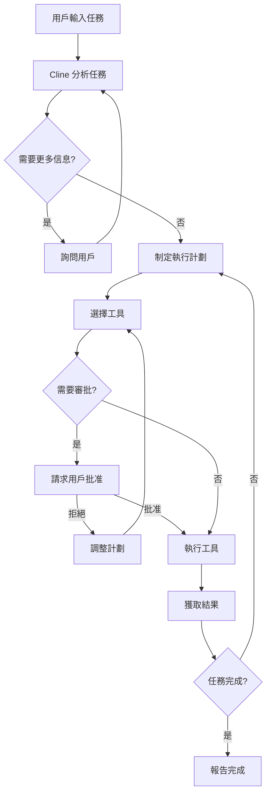

# Cline (原 Claude Dev) 程式碼解析

## 📚 專案概述

**Cline** 是一個 VS Code 擴展，將 Claude AI 直接整合到編輯器中，使其成為一個自主的編碼 Agent。它可以創建和編輯文件、執行終端命令、使用瀏覽器等，實現真正的 AI 輔助開發。

### 基本信息

- **原名**: Claude Dev
- **現名**: Cline
- **類型**: VS Code 擴展
- **主要功能**: AI 自主編碼 Agent
- **GitHub**: https://github.com/cline/cline
- **語言**: TypeScript
- **LLM**: 支持 Claude、GPT-4、Gemini 等

## 🎯 核心特性

### 1. 自主操作能力

Cline 可以：
- ✅ 創建和編輯文件
- ✅ 執行終端命令
- ✅ 使用瀏覽器搜索和抓取信息
- ✅ 分析項目結構
- ✅ 運行測試和調試
- ✅ 與用戶交互確認操作

### 2. 人機協作模式

- **審批機制**: 在執行關鍵操作前請求用戶批准
- **實時反饋**: 用戶可以隨時介入並提供指導
- **對話式交互**: 通過自然語言與 Cline 溝通

### 3. 工具集成

```typescript
工具列表:
├── execute_command     # 執行終端命令
├── read_file          # 讀取文件
├── write_to_file      # 寫入文件
├── search_files       # 搜索文件
├── list_files         # 列出文件
├── list_code_definition_names  # 列出代碼定義
├── browser_action     # 瀏覽器操作
├── ask_followup_question  # 詢問後續問題
└── attempt_completion    # 嘗試完成任務
```

## 🏗️ 架構設計

### 整體架構

```
┌─────────────────────────────────────────────────────┐
│                    VS Code UI                        │
│  ┌──────────────┐  ┌──────────────┐  ┌───────────┐ │
│  │  Chat Panel  │  │  File Viewer │  │  Settings │ │
│  └──────────────┘  └──────────────┘  └───────────┘ │
└─────────────────────────────────────────────────────┘
                          ↕
┌─────────────────────────────────────────────────────┐
│              Cline Core Engine                       │
│  ┌──────────────────────────────────────────────┐  │
│  │         Conversation Manager                  │  │
│  │  - 維護對話歷史                                │  │
│  │  - 管理上下文                                  │  │
│  │  - 處理用戶輸入                                │  │
│  └──────────────────────────────────────────────┘  │
│  ┌──────────────────────────────────────────────┐  │
│  │         Tool Executor                         │  │
│  │  - 執行工具調用                                │  │
│  │  - 處理審批流程                                │  │
│  │  - 返回執行結果                                │  │
│  └──────────────────────────────────────────────┘  │
│  ┌──────────────────────────────────────────────┐  │
│  │         LLM Provider                          │  │
│  │  - Anthropic (Claude)                        │  │
│  │  - OpenAI (GPT-4)                            │  │
│  │  - Google (Gemini)                           │  │
│  └──────────────────────────────────────────────┘  │
└─────────────────────────────────────────────────────┘
                          ↕
┌─────────────────────────────────────────────────────┐
│              File System & Terminal                  │
│  ┌────────────┐  ┌────────────┐  ┌──────────────┐  │
│  │   Files    │  │  Terminal  │  │   Browser    │  │
│  └────────────┘  └────────────┘  └──────────────┘  │
└─────────────────────────────────────────────────────┘
```

## 🔄 工作流程

### 1. 任務執行流程



### 2. 工具調用流程

```typescript
// 工具調用示例
interface ToolCall {
  tool: string;
  parameters: {
    [key: string]: any;
  };
}

// 執行流程
async function executeTool(toolCall: ToolCall): Promise<ToolResult> {
  // 1. 驗證工具調用
  validateTool(toolCall);

  // 2. 請求用戶審批（如需要）
  if (requiresApproval(toolCall)) {
    const approved = await requestApproval(toolCall);
    if (!approved) {
      return { success: false, message: "User denied" };
    }
  }

  // 3. 執行工具
  const result = await tools[toolCall.tool].execute(toolCall.parameters);

  // 4. 返回結果
  return result;
}
```

## 💻 核心代碼分析

### 1. 工具定義

```typescript
// src/core/tools/ToolExecutor.ts

export class ToolExecutor {
  private tools: Map<string, Tool>;

  constructor() {
    this.tools = new Map([
      ['execute_command', new ExecuteCommandTool()],
      ['read_file', new ReadFileTool()],
      ['write_to_file', new WriteToFileTool()],
      ['search_files', new SearchFilesTool()],
      ['list_files', new ListFilesTool()],
      ['browser_action', new BrowserActionTool()],
      // ... 其他工具
    ]);
  }

  async execute(toolName: string, params: any): Promise<ToolResult> {
    const tool = this.tools.get(toolName);
    if (!tool) {
      throw new Error(`Unknown tool: ${toolName}`);
    }

    return await tool.execute(params);
  }
}
```

### 2. 對話管理

```typescript
// src/core/ConversationManager.ts

export class ConversationManager {
  private messages: Message[] = [];
  private context: Context;

  async addUserMessage(content: string): Promise<void> {
    this.messages.push({
      role: 'user',
      content: content
    });

    await this.processMessage();
  }

  async processMessage(): Promise<void> {
    // 1. 構建 prompt
    const prompt = this.buildPrompt();

    // 2. 調用 LLM
    const response = await this.llmProvider.complete(prompt);

    // 3. 解析響應
    const toolCalls = this.parseToolCalls(response);

    // 4. 執行工具
    for (const toolCall of toolCalls) {
      const result = await this.toolExecutor.execute(
        toolCall.tool,
        toolCall.parameters
      );

      // 5. 添加結果到對話
      this.messages.push({
        role: 'tool',
        content: JSON.stringify(result)
      });
    }

    // 6. 如果有工具執行，繼續對話
    if (toolCalls.length > 0) {
      await this.processMessage();
    }
  }
}
```

### 3. 審批機制

```typescript
// src/core/ApprovalManager.ts

export class ApprovalManager {
  async requestApproval(action: Action): Promise<boolean> {
    // 1. 顯示待審批的操作
    const panel = vscode.window.createWebviewPanel(
      'clineApproval',
      'Cline - Action Approval',
      vscode.ViewColumn.Two,
      {}
    );

    panel.webview.html = this.getApprovalHtml(action);

    // 2. 等待用戶響應
    return new Promise((resolve) => {
      panel.webview.onDidReceiveMessage(
        message => {
          if (message.command === 'approve') {
            resolve(true);
          } else if (message.command === 'deny') {
            resolve(false);
          }
          panel.dispose();
        }
      );
    });
  }

  private getApprovalHtml(action: Action): string {
    return `
      <!DOCTYPE html>
      <html>
      <body>
        <h2>Cline wants to perform the following action:</h2>
        <pre>${JSON.stringify(action, null, 2)}</pre>
        <button onclick="approve()">Approve</button>
        <button onclick="deny()">Deny</button>
        <script>
          const vscode = acquireVsCodeApi();
          function approve() {
            vscode.postMessage({ command: 'approve' });
          }
          function deny() {
            vscode.postMessage({ command: 'deny' });
          }
        </script>
      </body>
      </html>
    `;
  }
}
```

## 🔑 關鍵特性實現

### 1. 文件操作

```typescript
// 寫入文件工具
class WriteToFileTool implements Tool {
  async execute(params: {
    path: string;
    content: string;
  }): Promise<ToolResult> {
    const uri = vscode.Uri.file(params.path);
    const encoder = new TextEncoder();

    await vscode.workspace.fs.writeFile(
      uri,
      encoder.encode(params.content)
    );

    return {
      success: true,
      message: `File written: ${params.path}`
    };
  }
}
```

### 2. 終端執行

```typescript
// 執行命令工具
class ExecuteCommandTool implements Tool {
  async execute(params: {
    command: string;
  }): Promise<ToolResult> {
    const terminal = vscode.window.createTerminal('Cline');
    terminal.show();
    terminal.sendText(params.command);

    // 捕獲輸出（簡化示例）
    const output = await this.captureOutput(terminal);

    return {
      success: true,
      output: output
    };
  }
}
```

### 3. 瀏覽器集成

```typescript
// 瀏覽器操作工具
class BrowserActionTool implements Tool {
  private browser: Browser;

  async execute(params: {
    action: 'navigate' | 'screenshot' | 'extract';
    url?: string;
  }): Promise<ToolResult> {
    switch (params.action) {
      case 'navigate':
        await this.browser.goto(params.url);
        break;
      case 'screenshot':
        const screenshot = await this.browser.screenshot();
        return { success: true, data: screenshot };
      case 'extract':
        const content = await this.browser.extractText();
        return { success: true, data: content };
    }

    return { success: true };
  }
}
```

## 🎯 與其他 Agent 的對比

### Cline vs Open Hands

| 特性 | Cline | Open Hands |
|------|-------|------------|
| **平台** | VS Code 擴展 | 獨立應用 |
| **界面** | 嵌入編輯器 | Web UI |
| **審批機制** | 實時交互 | 批處理模式 |
| **工具集成** | VS Code 生態 | Docker 容器 |
| **適用場景** | 日常編碼輔助 | 複雜任務自動化 |

### Cline vs Cursor

| 特性 | Cline | Cursor |
|------|-------|--------|
| **基礎** | VS Code 擴展 | Fork of VS Code |
| **自主性** | 高度自主 | 輔助編碼 |
| **交互方式** | 對話式 + 自動執行 | 主要是輔助建議 |
| **成本** | 使用自己的 API Key | 訂閱制 |

## 💡 最佳實踐

### 1. 任務描述

**好的任務描述**:
```
請幫我實現一個用戶認證系統，包括：
1. 用戶註冊和登錄
2. JWT token 驗證
3. 密碼加密
4. 使用 Express 和 MongoDB
5. 添加適當的錯誤處理
6. 編寫單元測試
```

**不好的任務描述**:
```
做一個登錄功能
```

### 2. 審批控制

- ✅ 對於文件修改，建議啟用審批
- ✅ 對於只讀操作，可以自動批准
- ✅ 對於終端命令，建議審核後執行
- ⚠️ 危險操作（如 `rm -rf`）必須手動審批

### 3. 上下文管理

```typescript
// 提供清晰的上下文
const context = {
  project: "E-commerce API",
  stack: "Node.js, Express, MongoDB",
  conventions: "使用 TypeScript，遵循 Airbnb 風格指南",
  testing: "使用 Jest 進行測試"
};
```

## 🚀 使用場景

### 1. 快速原型開發
- 從零開始創建新項目
- 快速實現功能原型
- 生成樣板代碼

### 2. 代碼重構
- 自動化重構任務
- 更新依賴和 API 調用
- 代碼風格統一

### 3. Bug 修復
- 分析錯誤日誌
- 定位問題代碼
- 實施修復方案

### 4. 文檔生成
- 自動生成 README
- 添加代碼註釋
- 創建 API 文檔

### 5. 測試編寫
- 生成單元測試
- 創建集成測試
- 編寫測試數據

## ⚠️ 注意事項

### 安全考慮

1. **代碼審查**: 始終審查 Cline 生成的代碼
2. **敏感信息**: 不要讓 Cline 處理密鑰、密碼等敏感信息
3. **命令執行**: 謹慎批准終端命令執行
4. **文件權限**: 注意文件寫入權限設置

### 成本控制

1. **API 調用**: 監控 API 使用量和成本
2. **上下文大小**: 大型項目可能產生大量 token 消耗
3. **循環預防**: 避免陷入無限工具調用循環

### 限制

1. **無法處理**: 需要圖形界面的操作
2. **理解限制**: 可能無法理解非常複雜的業務邏輯
3. **依賴環境**: 需要正確配置的開發環境

## 📖 學習資源

- [Cline GitHub](https://github.com/cline/cline)
- [VS Code Extension API](https://code.visualstudio.com/api)
- [Claude API Documentation](https://docs.anthropic.com/)

## 🔮 未來發展

Cline 的潛在發展方向：

1. **多 Agent 協作**: 支持多個 Cline 實例協作
2. **自定義工具**: 允許用戶添加自定義工具
3. **團隊協作**: 共享配置和最佳實踐
4. **更智能的規劃**: 更好的任務分解和執行計劃
5. **學習能力**: 從歷史交互中學習用戶偏好

---

**總結**: Cline 是一個強大的 AI 編碼助手，通過自主操作和人機協作模式，大幅提升開發效率。合理使用和配置，它可以成為日常開發中不可或缺的工具。
