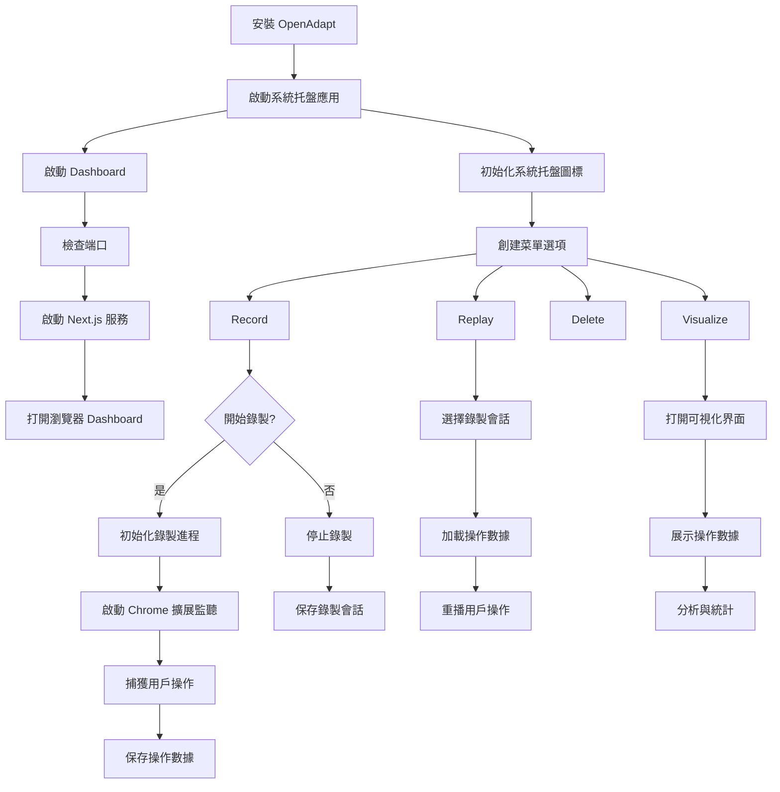

# OpenAdapt 程式碼解析

## 📚 專案概述

**OpenAdapt** 是一個開源的過程自動化 AI Agent,專注於通過記錄和重放用戶操作來實現自動化。它能夠學習用戶的操作模式,並使用 AI 來適應性地重放這些操作。

### 基本信息

- **名稱**: OpenAdapt
- **類型**: 過程自動化 AI Agent
- **主要功能**: 記錄、學習和重放用戶操作
- **GitHub**: https://github.com/OpenAdaptAI/OpenAdapt
- **語言**: Python
- **支持平台**: Windows, macOS, Linux
- **核心技術**: 多模態 LLM (視覺 + 文本)

### 核心理念

OpenAdapt 的設計理念是"通過演示進行編程"(Programming by Demonstration):
- 📹 **記錄**: 捕獲用戶的所有操作(鼠標、鍵盤、屏幕)
- 🧠 **學習**: 使用 AI 理解操作的語義和意圖
- 🔄 **重放**: 適應性地在不同環境中重放操作
- 🎯 **適應**: 處理 UI 變化和不同環境

## 🎯 核心特性

### 1. 多模態記錄

OpenAdapt 記錄多種類型的用戶交互:

```python
記錄的數據類型:
├── 屏幕錄製
│   ├── 截圖序列
│   ├── 窗口信息
│   └── UI 元素層次
├── 鼠標操作
│   ├── 移動軌跡
│   ├── 點擊事件
│   └── 滾動操作
├── 鍵盤輸入
│   ├── 按鍵序列
│   ├── 快捷鍵
│   └── 文本輸入
└── 系統事件
    ├── 窗口切換
    ├── 應用啟動
    └── 文件操作
```

### 2. 智能重放

使用視覺 AI 進行適應性重放:
- 🔍 **視覺定位**: 通過截圖識別 UI 元素
- 🧩 **模板匹配**: 處理 UI 布局變化
- 🤖 **AI 決策**: 當直接重放失敗時做出智能決策

### 3. 瀏覽器擴展支持

通過 Chrome 擴展捕獲更詳細的 Web 交互:
- DOM 結構
- JavaScript 事件
- 網絡請求
- 頁面導航

## 🏗️ 系統架構

### 整體架構圖



### 核心組件

```
┌──────────────────────────────────────────────────────┐
│                   UI 層                               │
│  ┌────────────┐  ┌────────────┐  ┌────────────────┐ │
│  │ System Tray │  │ Dashboard  │  │  Visualizer    │ │
│  │   (Qt)      │  │ (Next.js)  │  │   (Web UI)     │ │
│  └────────────┘  └────────────┘  └────────────────┘ │
└──────────────────────────────────────────────────────┘
                        ↕
┌──────────────────────────────────────────────────────┐
│                 核心引擎層                            │
│  ┌──────────────────────────────────────────────┐   │
│  │           Recording Engine                    │   │
│  │  - 捕獲屏幕                                    │   │
│  │  - 監聽鼠標/鍵盤                               │   │
│  │  - 提取 UI 元素                                │   │
│  └──────────────────────────────────────────────┘   │
│  ┌──────────────────────────────────────────────┐   │
│  │            Replay Engine                      │   │
│  │  - 加載錄製數據                                │   │
│  │  - AI 驅動的適應性重放                         │   │
│  │  - 視覺元素定位                                │   │
│  └──────────────────────────────────────────────┘   │
└──────────────────────────────────────────────────────┘
                        ↕
┌──────────────────────────────────────────────────────┐
│                   AI 層                               │
│  ┌────────────┐  ┌────────────┐  ┌──────────────┐  │
│  │   Vision   │  │    LLM     │  │   Adapters   │  │
│  │   Model    │  │   (GPT-4V)  │  │              │  │
│  └────────────┘  └────────────┘  └──────────────┘  │
└──────────────────────────────────────────────────────┘
                        ↕
┌──────────────────────────────────────────────────────┐
│                 數據存儲層                            │
│  ┌────────────┐  ┌────────────┐  ┌──────────────┐  │
│  │  Database  │  │Screenshots │  │   Metadata   │  │
│  │ (SQLite)   │  │   (Files)  │  │    (JSON)    │  │
│  └────────────┘  └────────────┘  └──────────────┘  │
└──────────────────────────────────────────────────────┘
```

## 💻 核心代碼分析

### 1. 記錄引擎

```python
# openadapt/record.py

class RecordingEngine:
    """記錄用戶操作的核心引擎"""

    def __init__(self):
        self.is_recording = False
        self.events = []
        self.screenshots = []
        self.session_id = None

        # 初始化監聽器
        self.mouse_listener = None
        self.keyboard_listener = None
        self.screen_capturer = None

    def start_recording(self, task_description: str) -> str:
        """開始錄製"""
        # 1. 創建新會話
        self.session_id = self._create_session(task_description)

        # 2. 啟動屏幕捕獲
        self.screen_capturer = ScreenCapturer(
            fps=1,  # 每秒一張截圖
            session_id=self.session_id
        )
        self.screen_capturer.start()

        # 3. 啟動鼠標監聽
        self.mouse_listener = mouse.Listener(
            on_move=self._on_mouse_move,
            on_click=self._on_mouse_click,
            on_scroll=self._on_mouse_scroll
        )
        self.mouse_listener.start()

        # 4. 啟動鍵盤監聽
        self.keyboard_listener = keyboard.Listener(
            on_press=self._on_key_press,
            on_release=self._on_key_release
        )
        self.keyboard_listener.start()

        # 5. 如果有瀏覽器擴展,啟動監聽
        if self._has_browser_extension():
            self._start_extension_listener()

        self.is_recording = True
        logger.info(f"Recording started: {self.session_id}")

        return self.session_id

    def _on_mouse_click(self, x: int, y: int, button, pressed: bool):
        """處理鼠標點擊事件"""
        if not self.is_recording:
            return

        # 記錄事件
        event = {
            'type': 'mouse_click',
            'timestamp': time.time(),
            'x': x,
            'y': y,
            'button': str(button),
            'pressed': pressed,
            # 獲取點擊時的窗口和元素信息
            'window': self._get_active_window(),
            'element': self._get_element_at(x, y)
        }

        self.events.append(event)
        self._save_event(event)

    def _on_key_press(self, key):
        """處理按鍵事件"""
        if not self.is_recording:
            return

        event = {
            'type': 'key_press',
            'timestamp': time.time(),
            'key': str(key),
            'window': self._get_active_window()
        }

        self.events.append(event)
        self._save_event(event)

    def _get_element_at(self, x: int, y: int) -> Dict:
        """獲取指定坐標的 UI 元素信息"""
        try:
            # 使用輔助功能 API 獲取元素
            element = UIAutomation.element_from_point(x, y)

            return {
                'name': element.name,
                'type': element.type,
                'role': element.role,
                'bounds': element.bounds,
                'states': element.states
            }
        except Exception as e:
            logger.warning(f"Failed to get element at ({x}, {y}): {e}")
            return {}

    def stop_recording(self):
        """停止錄製"""
        self.is_recording = False

        # 停止所有監聽器
        if self.mouse_listener:
            self.mouse_listener.stop()
        if self.keyboard_listener:
            self.keyboard_listener.stop()
        if self.screen_capturer:
            self.screen_capturer.stop()

        # 保存會話數據
        self._finalize_session()

        logger.info(f"Recording stopped: {self.session_id}")
```

### 2. 屏幕捕獲

```python
# openadapt/capture.py

class ScreenCapturer:
    """屏幕截圖捕獲器"""

    def __init__(self, fps: int, session_id: str):
        self.fps = fps
        self.session_id = session_id
        self.is_capturing = False
        self.capture_thread = None

        # 創建截圖存儲目錄
        self.screenshot_dir = f"./recordings/{session_id}/screenshots"
        os.makedirs(self.screenshot_dir, exist_ok=True)

    def start(self):
        """開始捕獲"""
        self.is_capturing = True
        self.capture_thread = threading.Thread(
            target=self._capture_loop,
            daemon=True
        )
        self.capture_thread.start()

    def _capture_loop(self):
        """捕獲循環"""
        interval = 1.0 / self.fps

        while self.is_capturing:
            start_time = time.time()

            try:
                # 捕獲屏幕
                screenshot = self._capture_screen()

                # 保存截圖
                timestamp = time.time()
                filename = f"{timestamp}.png"
                filepath = os.path.join(self.screenshot_dir, filename)
                screenshot.save(filepath)

                # 提取 UI 元素 (可選,取決於性能)
                if self._should_extract_ui():
                    ui_tree = self._extract_ui_tree()
                    self._save_ui_tree(timestamp, ui_tree)

            except Exception as e:
                logger.error(f"Capture error: {e}")

            # 控制幀率
            elapsed = time.time() - start_time
            sleep_time = max(0, interval - elapsed)
            time.sleep(sleep_time)

    def _capture_screen(self) -> Image:
        """捕獲屏幕截圖"""
        # 使用 PIL/Pillow
        with mss.mss() as sct:
            # 捕獲所有顯示器
            monitor = sct.monitors[0]  # 或指定特定顯示器
            screenshot = sct.grab(monitor)

            # 轉換為 PIL Image
            img = Image.frombytes(
                'RGB',
                screenshot.size,
                screenshot.bgra,
                'raw',
                'BGRX'
            )

            return img

    def _extract_ui_tree(self) -> Dict:
        """提取 UI 元素樹"""
        try:
            # 在 Windows 上使用 UIAutomation
            root = UIAutomation.get_root_element()
            tree = self._build_ui_tree(root)
            return tree
        except Exception as e:
            logger.error(f"UI extraction error: {e}")
            return {}

    def _build_ui_tree(self, element, depth: int = 0, max_depth: int = 5) -> Dict:
        """遞歸構建 UI 樹"""
        if depth > max_depth:
            return None

        node = {
            'name': element.name,
            'type': element.type,
            'role': element.role,
            'bounds': {
                'x': element.bounds.left,
                'y': element.bounds.top,
                'width': element.bounds.width,
                'height': element.bounds.height
            },
            'children': []
        }

        # 遞歸處理子元素
        for child in element.children:
            child_node = self._build_ui_tree(child, depth + 1, max_depth)
            if child_node:
                node['children'].append(child_node)

        return node
```

### 3. 重放引擎

```python
# openadapt/replay.py

class ReplayEngine:
    """重放錄製的操作"""

    def __init__(self, session_id: str, use_ai: bool = True):
        self.session_id = session_id
        self.use_ai = use_ai

        # 加載錄製數據
        self.events = self._load_events()
        self.screenshots = self._load_screenshots()

        # 初始化 AI 模型 (如果啟用)
        if use_ai:
            self.vision_model = VisionModel()
            self.llm = LLMClient()

    def replay(self) -> ReplayResult:
        """執行重放"""
        logger.info(f"Starting replay of session: {self.session_id}")

        results = []

        for i, event in enumerate(self.events):
            try:
                # 執行事件
                success = self._replay_event(event, i)

                results.append({
                    'event': event,
                    'success': success
                })

                # 添加延遲以模擬真實操作
                if i < len(self.events) - 1:
                    delay = self.events[i + 1]['timestamp'] - event['timestamp']
                    time.sleep(min(delay, 2.0))  # 最多延遲2秒

            except Exception as e:
                logger.error(f"Failed to replay event {i}: {e}")
                results.append({
                    'event': event,
                    'success': False,
                    'error': str(e)
                })

        return ReplayResult(results)

    def _replay_event(self, event: Dict, index: int) -> bool:
        """重放單個事件"""
        event_type = event['type']

        if event_type == 'mouse_click':
            return self._replay_mouse_click(event, index)
        elif event_type == 'key_press':
            return self._replay_key_press(event)
        elif event_type == 'mouse_move':
            return self._replay_mouse_move(event)
        else:
            logger.warning(f"Unknown event type: {event_type}")
            return False

    def _replay_mouse_click(self, event: Dict, index: int) -> bool:
        """重放鼠標點擊"""
        original_x = event['x']
        original_y = event['y']

        if self.use_ai:
            # 使用 AI 定位元素
            target_x, target_y = self._find_element_with_ai(event, index)
            if target_x is None:
                logger.warning("AI failed to locate element, using original coordinates")
                target_x, target_y = original_x, original_y
        else:
            # 直接使用原始坐標
            target_x, target_y = original_x, original_y

        # 執行點擊
        mouse_controller = Controller()
        mouse_controller.position = (target_x, target_y)

        button = Button.left if 'left' in event['button'] else Button.right

        if event['pressed']:
            mouse_controller.press(button)
        else:
            mouse_controller.release(button)

        return True

    def _find_element_with_ai(self, event: Dict, index: int) -> Tuple[int, int]:
        """使用 AI 視覺模型定位元素"""
        # 1. 獲取錄製時的截圖
        original_screenshot = self.screenshots[index]

        # 2. 獲取當前屏幕截圖
        current_screenshot = self._capture_current_screen()

        # 3. 提取點擊區域
        x, y = event['x'], event['y']
        click_region = self._extract_region(original_screenshot, x, y, radius=50)

        # 4. 使用視覺模型在當前屏幕中找到相似區域
        prompt = f"""
        Find the location of the UI element in the current screenshot that matches
        the clicked element in the original screenshot.

        Original click location: ({x}, {y})
        Element info: {event.get('element', {})}
        """

        response = self.vision_model.locate_element(
            original_image=original_screenshot,
            current_image=current_screenshot,
            click_region=click_region,
            prompt=prompt
        )

        return response['x'], response['y']
```

### 4. AI 視覺模型集成

```python
# openadapt/vision.py

class VisionModel:
    """視覺 AI 模型用於元素定位"""

    def __init__(self, model: str = "gpt-4-vision-preview"):
        self.model = model
        self.client = OpenAI()

    def locate_element(self,
                      original_image: Image,
                      current_image: Image,
                      click_region: Image,
                      prompt: str) -> Dict:
        """使用視覺模型定位元素"""

        # 1. 編碼圖像為 base64
        current_b64 = self._encode_image(current_image)
        region_b64 = self._encode_image(click_region)

        # 2. 構建提示詞
        messages = [
            {
                "role": "user",
                "content": [
                    {
                        "type": "text",
                        "text": prompt + "\n\nAnalyze the current screenshot and return the coordinates where I should click. Return JSON: {\"x\": int, \"y\": int, \"confidence\": float}"
                    },
                    {
                        "type": "image_url",
                        "image_url": {
                            "url": f"data:image/png;base64,{current_b64}"
                        }
                    },
                    {
                        "type": "text",
                        "text": "Target element to find:"
                    },
                    {
                        "type": "image_url",
                        "image_url": {
                            "url": f"data:image/png;base64,{region_b64}"
                        }
                    }
                ]
            }
        ]

        # 3. 調用 API
        response = self.client.chat.completions.create(
            model=self.model,
            messages=messages,
            max_tokens=300,
            response_format={"type": "json_object"}
        )

        # 4. 解析響應
        result = json.loads(response.choices[0].message.content)

        return result

    def _encode_image(self, image: Image) -> str:
        """將圖像編碼為 base64"""
        buffered = BytesIO()
        image.save(buffered, format="PNG")
        return base64.b64encode(buffered.getvalue()).decode()
```

## 🎯 使用場景

### 場景 1: 自動化重複性任務

```python
# 錄製一次,多次重放

# 1. 錄製操作
recorder = RecordingEngine()
session_id = recorder.start_recording("填寫每日報表")

# 用戶手動執行操作:
# - 打開 Excel
# - 輸入數據
# - 保存文件
# - 發送郵件

recorder.stop_recording()

# 2. 每天自動重放
replay_engine = ReplayEngine(session_id, use_ai=True)
result = replay_engine.replay()

if result.success_rate > 0.9:
    print("任務完成!")
else:
    print(f"部分失敗,成功率: {result.success_rate}")
```

### 場景 2: 跨環境遷移

```python
# 在開發環境錄製,在生產環境重放

# 開發環境錄製
dev_recorder = RecordingEngine()
session_id = dev_recorder.start_recording("部署應用流程")
# ... 執行部署操作 ...
dev_recorder.stop_recording()

# 生產環境重放
prod_replay = ReplayEngine(session_id, use_ai=True)
# AI 會適應不同的 UI 布局和路徑
prod_replay.replay()
```

### 場景 3: UI 測試自動化

```python
# 錄製用戶測試場景

recorder = RecordingEngine()
session_id = recorder.start_recording("用戶註冊流程測試")
# ... 執行註冊流程 ...
recorder.stop_recording()

# 回歸測試
for version in ['v1.0', 'v1.1', 'v2.0']:
    setup_app(version)
    replay = ReplayEngine(session_id, use_ai=True)
    result = replay.replay()

    assert result.success_rate > 0.95, f"版本 {version} 測試失敗"
```

## 📊 與其他工具的對比

### OpenAdapt vs Selenium

| 特性 | OpenAdapt | Selenium |
|------|-----------|----------|
| **適用範圍** | 任何桌面應用 | 僅 Web 瀏覽器 |
| **編程需求** | 無需編程,通過演示 | 需要編寫代碼 |
| **適應性** | AI 驅動,自動適應 UI 變化 | 硬編碼選擇器,脆弱 |
| **學習曲線** | 低,直觀 | 中等,需要學習 API |
| **維護成本** | 低,AI 自動適應 | 高,UI 變化需更新代碼 |

### OpenAdapt vs RPA 工具 (UiPath, Automation Anywhere)

| 特性 | OpenAdapt | 傳統 RPA |
|------|-----------|---------|
| **成本** | 開源,免費 | 昂貴的許可證 |
| **AI 能力** | 內置視覺 AI | 有限或額外收費 |
| **靈活性** | 可編程擴展 | 通常專有封閉 |
| **部署** | 輕量級,單機 | 企業級,複雜 |

## ⚠️ 注意事項

### 隱私和安全

1. **敏感數據**: 錄製可能捕獲密碼和敏感信息
```python
# 配置敏感數據過濾
recorder = RecordingEngine()
recorder.add_filter(PasswordFilter())  # 自動模糊密碼字段
recorder.add_filter(CreditCardFilter())  # 過濾信用卡號
```

2. **加密存儲**: 加密錄製數據
```python
# 啟用加密
config = {
    'encryption_enabled': True,
    'encryption_key': os.getenv('OPENADAPT_KEY')
}
```

### 限制

1. **視覺識別準確性**: AI 模型可能無法 100% 準確定位所有元素
2. **性能開銷**: 實時截圖和 AI 推理消耗資源
3. **複雜邏輯**: 不適合需要複雜決策的任務

## 🚀 最佳實踐

### 1. 錄製高質量會話

```python
# 好的實踐:
- 緩慢清晰地執行操作
- 等待頁面/應用完全加載
- 使用明確的點擊和輸入
- 添加明確的任務描述

# 不好的實踐:
- 快速隨意操作
- 在加載時點擊
- 使用快捷鍵 (可能不可移植)
```

### 2. 測試重放

```python
# 在部署前測試
replay = ReplayEngine(session_id, use_ai=True)

# 乾運行 (不實際執行)
result = replay.dry_run()
print(f"預計成功率: {result.estimated_success_rate}")

# 實際重放
if result.estimated_success_rate > 0.8:
    replay.replay()
```

### 3. 監控和日誌

```python
# 配置詳細日誌
logging.basicConfig(level=logging.DEBUG)

# 設置回調
def on_event(event, status):
    print(f"Event: {event['type']}, Status: {status}")

replay.on_event = on_event
```

## 📚 學習資源

- **GitHub**: https://github.com/OpenAdaptAI/OpenAdapt
- **文檔**: https://openadapt.ai/docs
- **論文**: [Multimodal AI for Process Automation](研究論文鏈接)

## 🔮 未來發展

1. **更強的 AI 模型**: 使用更先進的視覺和推理模型
2. **雲端協作**: 共享和重用錄製會話
3. **移動支持**: 擴展到 iOS 和 Android
4. **實時編輯**: 在重放前編輯錄製的操作
5. **自然語言控制**: 使用語言描述修改操作

---

**總結**: OpenAdapt 是一個創新的過程自動化工具,通過"演示編程"和 AI 驅動的適應性重放,大大簡化了自動化任務的創建和維護。它特別適合非技術用戶和需要跨環境遷移的場景。
