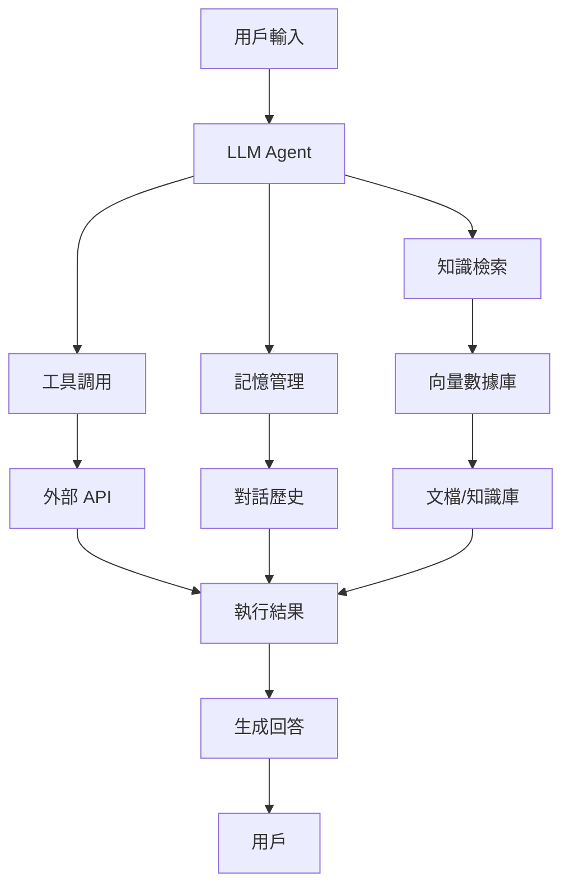

# LLM Agent Demo 文檔

**完整的 LLM Agent 框架學習資源庫**

[快速開始](getting-started/quickstart.md){ .md-button .md-button--primary }
[查看 GitHub](https://github.com/markl-a/LLM-agent-Demo){ .md-button }

---

## 📚 專案簡介

LLM Agent Demo 是一個全面的 LLM (Large Language Model) Agent 開發學習資源庫，涵蓋了主流的 Agent 框架和實際應用案例。

### ✨ 特色

- 🎯 **多框架覆蓋**: 涵蓋 6 大主流框架（LangChain、LlamaIndex、AutoGen、CrewAI、MetaGPT、LangGraph）
- 📖 **系統化學習路徑**: 從 AI 基礎到進階應用的完整學習路徑
- 💻 **實戰導向**: 提供豐富的可運行範例和實際應用案例
- 🌏 **中文資源**: 詳盡的中文文檔和註釋
- 🆕 **持續更新**: 緊跟最新技術發展，定期更新內容

---

## 🚀 快速導航

-   :material-rocket-launch:{ .lg .middle } __快速開始__

    ---

    零基礎快速上手 LLM Agent 開發

    [:octicons-arrow-right-24: 開始學習](getting-started/quickstart.md)

-   :material-library:{ .lg .middle } __框架教程__

    ---

    深入學習主流 LLM Agent 框架

    [:octicons-arrow-right-24: 框架教程](frameworks/langchain/introduction.md)

-   :material-application:{ .lg .middle } __實際應用__

    ---

    學習生產級應用案例

    [:octicons-arrow-right-24: 應用案例](applications/document-qa.md)

-   :material-chart-bar:{ .lg .middle } __框架對比__

    ---

    了解不同框架的優劣和選擇指南

    [:octicons-arrow-right-24: 對比分析](comparison/selection-guide.md)

---

## 🎓 學習路徑

### 初級路徑（入門）

1. [AI 基礎知識](ai-basics/ai-history.md)
2. [大型語言模型簡介](ai-basics/large-language-models.md)
3. [LangChain 快速開始](frameworks/langchain/introduction.md)
4. [構建第一個 RAG 應用](frameworks/langchain/rag-qa.md)

### 中級路徑（進階）

1. [LlamaIndex 深入學習](frameworks/llamaindex/introduction.md)
2. [向量數據庫與檢索](frameworks/langchain/vector-retrieval.md)
3. [Agent 工具使用](frameworks/langchain/agents.md)
4. [多模態 RAG](advanced/multimodal-rag.md)

### 高級路徑（專家）

1. [多 Agent 協作](frameworks/langchain/multi-agent.md)
2. [AutoGen 框架](frameworks/autogen/introduction.md)
3. [MetaGPT 軟體開發](frameworks/metagpt/software-development.md)
4. [性能優化與成本控制](advanced/optimization.md)

---

## 📊 支援的框架

| 框架 | 版本 | 特點 | 適用場景 |
|------|------|------|----------|
| **LangChain** | 0.3+ | 生態完善 | RAG、聊天機器人、複雜鏈 |
| **LlamaIndex** | 0.12+ | 索引優異 | 企業知識庫、文檔問答 |
| **AutoGen** | 0.3+ | 多 Agent | 複雜任務、自動化 |
| **CrewAI** | 1.0+ | 角色清晰 | 團隊協作、內容創作 |
| **MetaGPT** | 0.8+ | 軟體流程 | 專案管理、代碼生成 |

---

## 💡 實際應用案例

### 1. [文檔問答系統](applications/document-qa.md)

基於 RAG 技術的企業級文檔問答系統，支持多種文檔格式，提供準確的答案和來源追蹤。

**技術棧**: LlamaIndex + ChromaDB + OpenAI + Streamlit

### 2. [智能客服機器人](applications/customer-service.md)

24/7 自動化客戶服務，支持多輪對話、意圖識別和情感分析。

**技術棧**: LangChain + Memory Management + Tool Calling

### 3. [代碼助手](applications/code-assistant.md)

協助開發者編寫、理解和調試代碼的智能助手。

**技術棧**: LangChain + Code Understanding + AST Parsing

### 4. [智能搜索引擎](applications/smart-search.md)

語義搜索引擎，提供比傳統關鍵詞搜索更準確的結果。

**技術棧**: LlamaIndex + Hybrid Retrieval + Reranking

---

## 🛠️ 技術架構

---

## 📈 專案統計

- 📝 **68+** Markdown 文檔
- 📓 **23+** Jupyter Notebooks
- 🐍 **28+** Python 範例
- 🧪 **200+** 行測試代碼
- ⭐ **6** 大主流框架
- 💼 **11** 個完整教程
- 🎯 **4** 個實戰案例

---

## 🤝 如何貢獻

我們歡迎所有形式的貢獻！請查看我們的[貢獻指南](contributing/how-to-contribute.md)。

- 🐛 報告 Bug
- 💡 提出新功能
- 📝 改進文檔
- 💻 提交代碼

---

## 📄 許可證

本專案採用 [MIT License](about/license.md) 開源許可證。

---

## 🙏 致謝

感謝所有貢獻者和開源社區的支持！

特別感謝:
- LangChain 團隊
- LlamaIndex 團隊
- AutoGen 團隊
- CrewAI 團隊
- MetaGPT 團隊

---

**⭐ 如果這個專案對你有幫助，請給它一個星標！**

Made with ❤️ by [markl-a](https://github.com/markl-a)

